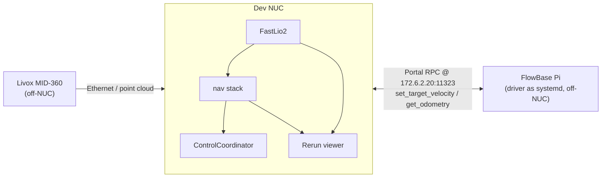

# FlowBase

Holonomic base control over Portal RPC. Coordinator side lives here; the
driver runs on the i2rt base.

## External system



Sensor and base driver are both off-NUC. The dev NUC runs everything in
between (FastLio2, nav stack, ControlCoordinator, Rerun viewer).

## 1. FlowBase driver

The driver (`flow_base_controller_modified.py`) runs on the FlowBase Pi as
a **systemd service** and starts automatically on boot. No SSH needed for
normal operation — it exposes a Portal RPC server on `172.6.2.20:11323`
(`set_target_velocity`, `get_odometry`) the moment the Pi is powered up.

To debug or restart the service:

```bash
ssh i2rt@172.6.2.20
systemctl --user status flow_base_controller    # check it's running
systemctl --user restart flow_base_controller   # restart
journalctl --user -u flow_base_controller -f    # tail logs
```

A `No joystick/gamepad connected` line in the logs is normal — RPC works
without a gamepad.

Verify reachability from your dev machine:

```bash
nc -vz 172.6.2.20 11323
```

## 2. Launch

Three blueprints, in increasing order of capability:

```bash
# Coordinator only (drive /cmd_vel from another source)
dimos run coordinator-flowbase

# Coordinator + WASD pygame teleop
dimos run coordinator-flowbase-keyboard-teleop

# Coordinator + FastLio2 + nav stack + click-to-drive in Rerun
LIDAR_HOST_IP=192.168.1.5 LIDAR_IP=192.168.1.189 \
WAYLAND_DISPLAY=wayland-0 XDG_SESSION_TYPE=wayland \
  dimos run coordinator-flowbase-nav
```

All three use the `flowbase` adapter against `172.6.2.20:11323` and
publish/subscribe on LCM `/cmd_vel` + `/coordinator/joint_state`.

### Blueprint notes

- **`coordinator-flowbase-nav`** composes `FastLio2` SLAM +
  `create_nav_stack(planner="simple")` + `MovementManager` (for click
  forwarding and tele/nav velocity mux) + `ControlCoordinator` with the
  FlowBase adapter as the driver. Mirrors `unitree-g1-nav-onboard` for the
  perception/planning half. Click anywhere on the floor in the Rerun 3D
  viewer → robot navigates there.
- **`coordinator-flowbase-keyboard-teleop`** opens a small pygame window —
  **focus that window** to drive. Controls: W/S forward-back · Q/E strafe ·
  A/D turn · Shift boost · Ctrl slow · Space stop · ESC quit.
- **`coordinator-flowbase`** is just the bare driver; you publish `/cmd_vel`
  from somewhere else.

### Env defaults (nav blueprint)

| Variable | Default | Meaning |
|---|---|---|
| `LIDAR_HOST_IP` | `192.168.1.5` | This machine's IP on the LIDAR subnet |
| `LIDAR_IP` | `192.168.1.189` | Livox MID-360 IP |
| `WAYLAND_DISPLAY` | (unset) | Set to `wayland-0` so the native Rerun viewer can render |
| `XDG_SESSION_TYPE` | `tty` (in remote terminals) | Set to `wayland` for the same reason |

Sensor mount is hardcoded in `_flowbase_mid360_mount` at 20cm forward /
20cm right / 10cm up of base center, level orientation. Edit
[mobile.py](../../../control/blueprints/mobile.py) to change.

> **Sanity check before the nav blueprint**: run `dimos run mid360-fastlio`
> first to verify the LIDAR locks in. If FastLio2 can't see the sensor,
> nav won't start.

> **`nix develop` breaks the Rerun viewer** — its `libvulkan` shadows the
> system one and the native viewer fails surface creation. Run `dimos run`
> from a plain `.venv` shell (native modules are cached after the first
> build, so `nix develop` isn't needed at runtime).

## Notes

- Frame convention: FlowBase uses inverted Y/yaw. The adapter negates
  `vy` and `wz` before sending — commands in / odometry out are standard
  ROS frame.
- Address override: edit `_flowbase_twist_base(address=...)` in
  [mobile.py](../../../control/blueprints/mobile.py).
- LIDAR mount: edit `_flowbase_mid360_mount` in the same file (set a
  tilted quaternion if the MID-360 isn't level).
- `local_planner` reuses `G1_LOCAL_PLANNER_PRECOMPUTED_PATHS` for now. If
  local planning is unstable, generate FlowBase-specific paths as a
  follow-up.
