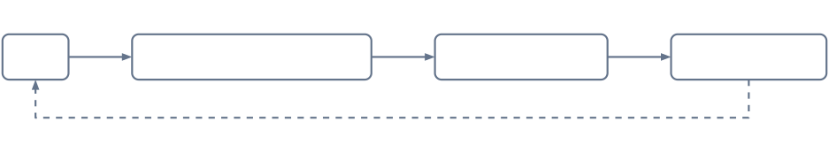
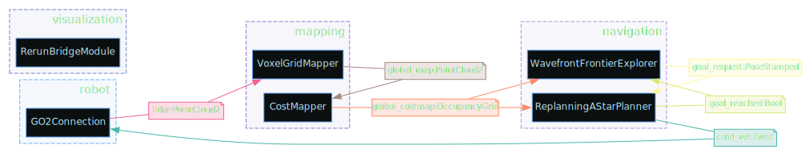

The Go2 navigation stack runs entirely without ROS. It uses a **column-carving voxel map** strategy: each new LiDAR frame replaces the corresponding region of the global map entirely, ensuring the map always reflects the latest observations.


For return visits to a known space, use [premap relocalization](/docs/capabilities/navigation/relocalization.md) instead of relying on live mapping alone.

## Data Flow

<details>
<summary>diagram source</summary>

```pikchr fold output=assets/go2nav_dataflow.svg
color = 0x64748B
fill = none

Go2: box "Go2" rad 5px fit wid 170% ht 170%
arrow right 0.5in
Vox: box "VoxelGridMapper" rad 5px fit wid 170% ht 170%
arrow right 0.5in
Cost: box "CostMapper" rad 5px fit wid 170% ht 170%
arrow right 0.5in
Nav: box "Navigation" rad 5px fit wid 170% ht 170%

M1: dot at 1/2 way between Go2.e and Vox.w invisible
text "PointCloud2" italic at (M1.x, Go2.n.y + 0.15in)

M2: dot at 1/2 way between Vox.e and Cost.w invisible
text "PointCloud2" italic at (M2.x, Vox.n.y + 0.15in)

M3: dot at 1/2 way between Cost.e and Nav.w invisible
text "OccupancyGrid" italic at (M3.x, Cost.n.y + 0.15in)

arrow dashed from Nav.s down 0.3in then left until even with Go2.s then to Go2.s
M4: dot at 1/2 way between Go2.s and Nav.s invisible
text "Twist" italic at (M4.x, Nav.s.y - 0.45in)
```

</details>



## Pipeline Steps

### 1. LiDAR Frame ([`GO2Connection`](/dimos/robot/unitree/go2/connection.py))

We do not connect to the LiDAR directly. Instead we use Unitree's WebRTC client via [legion's webrtc driver](https://github.com/legion1581/unitree_webrtc_connect), which streams a heavily preprocessed 5cm voxel grid rather than raw point cloud data. This lets us support stock, unjailbroken Go2 Air and Pro models out of the box.


### 2. Global Voxel Map ([`VoxelGridMapper`](/dimos/mapping/voxels.py))

The [`VoxelGridMapper`](/dimos/mapping/voxels.py) maintains a sparse 3D occupancy grid using Open3D's `VoxelBlockGrid` backed by a hash map. Each voxel is a 5cm cube by default.

Voxel hash map provides O(1) insert/erase/lookup, so this is efficient even with millions of voxels. The grid runs on **CUDA** by default for speed, with CPU fallback.

Each incoming LiDAR frame is spliced into the global map via column carving: any previously mapped voxels in the space of a received LiDAR frame are considered stale, and entire Z-columns in its footprint are erased before the new frame is written. This guarantees:

- No ghost obstacles from previous passes
- Dynamic objects (people, doors) get cleared automatically
- The latest observation always wins

Live column-carving has no loop closure. We trust Go2 odometry, which is stable but drifts over distance. You can reliably map and navigate large spaces around 500 m² in our tests, but not kilometer-scale outdoor routes. For return visits with loop-closed maps, use [premap relocalization](/docs/capabilities/navigation/relocalization.md) and build the premap offline with `dimos map global --export`.


#### Configuration

| Parameter          | Default   | Description                                             |
|--------------------|-----------|---------------------------------------------------------|
| `voxel_size`       | 0.05      | Voxel cube size in meters                               |
| `block_count`      | 2,000,000 | Max voxels in hash map                                  |
| `device`           | `CUDA:0`  | Compute device (`CUDA:0` or `CPU:0`)                    |
| `carve_columns`    | `true`    | Enable column carving (disable for append-only mapping) |
| `emit_every`       | 1         | Publish the map every Nth frame (1 = every frame)       |


### 3. Global Costmap ([`CostMapper`](/dimos/mapping/costmapper.py))

The [`CostMapper`](/dimos/mapping/costmapper.py) converts the 3D voxel map into a 2D occupancy grid. The default algorithm (`height_cost`) maps rate of change of Z, with some smoothing.

Algorithm settings live in [`occupancy.py`](/dimos/mapping/pointclouds/occupancy.py) and can be configured per robot.


#### Configuration

```python skip
@dataclass(frozen=True)
class HeightCostConfig(OccupancyConfig):
    """Config for height-cost based occupancy (terrain slope analysis)."""
    can_pass_under: float = 0.6
    can_climb: float = 0.15
    ignore_noise: float = 0.05
    smoothing: float = 1.0
```

| Cost | Meaning                                                  |
|------|----------------------------------------------------------|
| 0    | Flat, easy to traverse                                   |
| 50   | Moderate slope (~7.5cm rise per cell in case of go2)     |
| 100  | Steep or impassable (≥15cm rise per cell in case of go2) |
| -1   | Unknown (no observations)                                |


### 4. Navigation Costmap ([`ReplanningAStarPlanner`](/dimos/navigation/replanning_a_star/module.py))

The planner processes the terrain gradient and computes its own planning costmap, preferring safe free paths but willing to path aggressively through tight spaces when it has to.

We run the planner in a constant loop so it dynamically reacts to obstacles as they appear.


### 5. All Layers Combined

All visualization layers shown together:


## Frontier Exploration

The [`WavefrontFrontierExplorer`](/dimos/navigation/frontier_exploration/wavefront_frontier_goal_selector.py) drives autonomous exploration of unknown space. It scans the costmap for frontiers, the boundaries between mapped and unmapped cells, picks the best candidate with a wavefront BFS from the robot's position, and publishes it as a navigation goal. When a goal is reached (or fails), it selects the next frontier until the space is fully mapped. Like patrolling below, it is exposed as an agent skill: an LLM agent can call `begin_exploration` and `end_exploration`.

## Patrolling

The patrolling system drives the robot to systematically cover a **known** area. It is exposed as an agent skill. An LLM agent can call `start_patrol` and `stop_patrol` to control it. Note that the area has to be explored first.

### How it works

1. **Visitation tracking:** As the robot moves, a visitation grid aligned to the costmap marks cells around the robot's position as visited. This gives the system a running picture of where the robot has and has not been. Visits expire over time and cells must be covered again.

2. **Goal selection:** A patrol router picks the next goal. The default strategy is coverage: it samples candidate points from unvisited, obstacle-free cells, plans a path to each one, and picks the candidate whose path would cover the most new ground. Candidates are weighted by a Voronoi skeleton so goals spread evenly across the map rather than clustering in large open areas.

3. **Navigation loop:** The module sends each goal to the planner and waits for a `goal_reached` signal before requesting the next one. If no valid goal is available, for example when the map has not loaded yet, it retries after a short delay.

4. **Stopping:** When patrol is stopped, the module cancels in-progress navigation by publishing the robot's current pose as the goal, then re-enables the planner's normal replanning behavior.

### Patrol router strategies

| Router       | Behavior                                                                                       |
|--------------|------------------------------------------------------------------------------------------------|
| `coverage`   | Maximizes new-cell coverage per goal. Uses Voronoi weighting for even spatial distribution.     |
| `random`     | Picks a random unvisited, obstacle-free cell.                                                  |
| `frontier`   | Targets the boundary between known and unknown space, useful for exploration-style patrol.      |

### Safety

Goal candidates are filtered through a safe mask, which is the free-space region eroded by the robot's clearance radius, so the robot is never sent too close to walls or obstacles. The planner's safe-goal clearance is also tightened while patrolling so the robot can rotate in place at every goal.

### Router comparison

| Coverage | Frontier | Random |
|----------|----------|--------|
|  |  |  |

### Sample patrol trace (26 min)


## Blueprint Composition

The navigation stack is composed in the [`unitree_go2`](/dimos/robot/unitree/go2/blueprints/smart/unitree_go2.py) blueprint:

```python skip fold output=assets/go2_blueprint.svg
from dimos.core.coordination.blueprints import autoconnect
from dimos.core.introspection.svg import to_svg
from dimos.mapping.costmapper import CostMapper
from dimos.mapping.voxels import VoxelGridMapper
from dimos.navigation.frontier_exploration.wavefront_frontier_goal_selector import (
    WavefrontFrontierExplorer,
)
from dimos.navigation.movement_manager.movement_manager import MovementManager
from dimos.navigation.patrolling.module import PatrollingModule
from dimos.navigation.replanning_a_star.module import ReplanningAStarPlanner
from dimos.robot.unitree.go2.blueprints.basic.unitree_go2_basic import unitree_go2_basic

unitree_go2 = autoconnect(
    unitree_go2_basic,
    VoxelGridMapper.blueprint(emit_every=5),
    CostMapper.blueprint(),
    ReplanningAStarPlanner.blueprint(),
    WavefrontFrontierExplorer.blueprint(),
    PatrollingModule.blueprint(),
    MovementManager.blueprint(),
).global_config(n_workers=10, robot_model="unitree_go2")

to_svg(unitree_go2, "assets/go2_blueprint.svg")
```

