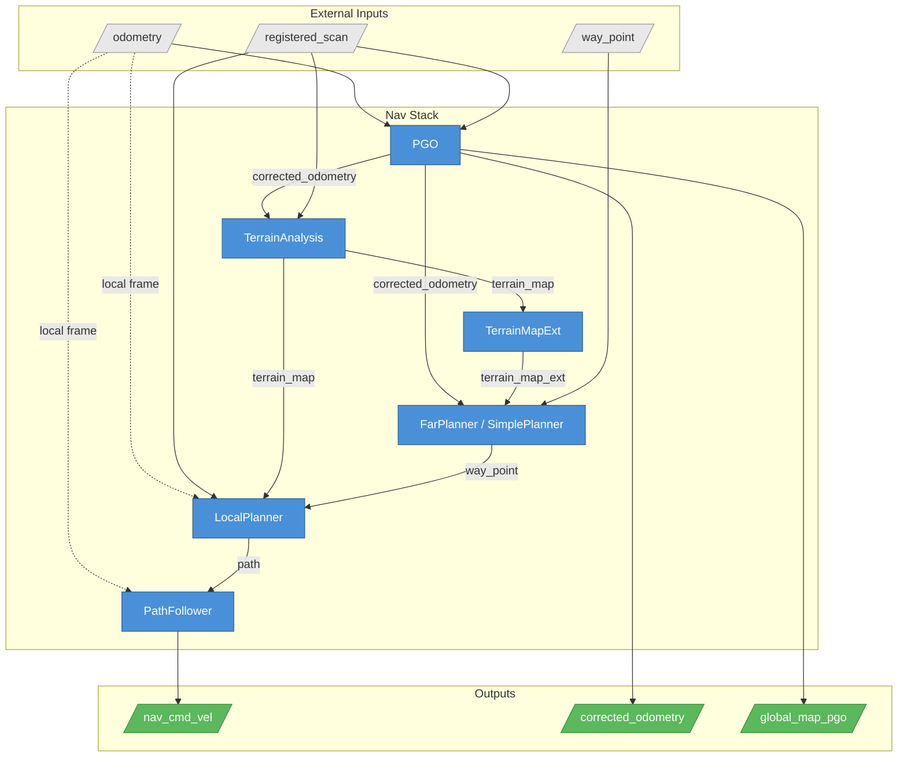

# Nav Stack

A modular navigation stack for autonomous robot navigation: terrain classification, obstacle avoidance, global path planning, local trajectory selection, and loop-closure-corrected mapping — composed as Blueprint modules.

Good fit when you have a lidar-equipped robot and need end-to-end autonomy: feed it a registered point cloud and odometry, and it produces velocity commands. No ROS — modules communicate over DimOS streams (LCM/SHM).

```python session=nav_stack
from dimos.navigation.nav_stack.main import create_nav_stack

blueprint = create_nav_stack()
```

## Streams

The stack consumes (typically from a SLAM module like `FastLio2`):

| Stream | Type | Description |
|--------|------|-------------|
| `registered_scan` | `PointCloud2` | World-frame lidar scan |
| `odometry` | `Odometry` | SLAM odometry |

It needs a goal source — `way_point` (`PointStamped`) drives the planners. A separate `MovementManager` module (`dimos/navigation/movement_manager/movement_manager.py`) is the usual goal source: it accepts `clicked_point` from a viewer/agent and produces `way_point`, plus it muxes `nav_cmd_vel` with `tele_cmd_vel` into the final `cmd_vel`.

The stack produces:

| Stream | Type | Description |
|--------|------|-------------|
| `nav_cmd_vel` | `Twist` | Velocity command (becomes `cmd_vel` after MovementManager) |
| `corrected_odometry` | `Odometry` | PGO loop-closure-corrected pose |
| `global_map_pgo` | `PointCloud2` | Accumulated keyframe map |

## Customizing

All configuration goes through `create_nav_stack()` keyword arguments. Top-level switches plus per-module config dicts:

```python skip
create_nav_stack(
    planner="simple",              # "far" (default) or "simple" (A*)
    use_tare=False,                # Add TARE frontier exploration
    use_terrain_map_ext=True,      # Persistent terrain accumulator
    vehicle_height=None,           # Propagated to terrain + planners
    max_speed=None,                # Propagated to local planner + path follower
    waypoint_threshold=None,       # "Close enough" distance (m)
    terrain_voxel_size=0.2,
    replan_rate=0.5,               # Global planner replan rate (Hz)
    record=False,                  # Enable NavRecord module

    # Per-module config overrides (merged onto defaults):
    terrain_analysis={...},
    local_planner={...},
    path_follower={...},
    far_planner={...},
    simple_planner={...},
    pgo={...},
    tare_planner={...},
    terrain_map_ext={...},
    nav_record={...},
)
```

### Global planner

- **FarPlanner** (default) — visibility-graph planner, larger sensor range. Better for outdoor/long-range.
- **SimplePlanner** (`planner="simple"`) — grid-based A*. Lighter, easier to debug.

### Exploration

`use_tare=True` adds the TARE frontier exploration module, which takes over waypoint generation and drives toward unexplored frontiers.

### Obstacle sensitivity

Keep `obstacle_height_threshold` aligned between TerrainAnalysis and LocalPlanner — if TerrainAnalysis flags something but LocalPlanner's threshold is higher, the planner will drive through it.

```python session=nav_stack
create_nav_stack(
    terrain_analysis={"obstacle_height_threshold": 0.1},
    local_planner={"obstacle_height_threshold": 0.1},
)
```

```results
Blueprint(blueprints=(BlueprintAtom(kwargs={'scan_voxel_size': 0.05, 'terrain_voxel_size': 0.2, 'terrain_voxel_half_width': 10, 'obstacle_height_threshold': 0.1, 'ground_height_threshold': 0.1, 'min_relative_z': -1.5, 'max_relative_z': 0.3, 'use_sorting': True, 'quantile_z': 0.25, 'decay_time': 1.0, 'no_decay_distance': 1.5, 'clearing_distance': 8.0, 'clear_dynamic_obstacles': True, 'no_data_obstacle': False, 'no_data_block_skip_count': 0, 'min_block_point_count': 10, 'voxel_point_update_threshold': 100, 'voxel_time_update_threshold': 2.0, 'min_dynamic_obstacle_distance': 0.14, 'abs_dynamic_obstacle_relative_z_threshold': 0.2, 'min_dynamic_obstacle_vfov': -55.0, 'max_dynamic_obstacle_vfov': 10.0, 'min_dynamic_obstacle_point_count': 1, 'min_out_of_fov_point_count': 20, 'consider_drop': False, 'limit_ground_lift': False, 'max_ground_lift': 0.15, 'distance_ratio_z': 0.2, 'vehicle_height': 1.5}, module=<class 'dimos.navigation.nav_stack.modules.terrain_analysis.terrain_analysis.TerrainAnalysis'>, streams=(StreamRef(name='registered_scan', type=<class 'dimos.msgs.sensor_msgs.PointCloud2.PointCloud2'>, direction='in'), StreamRef(name='odometry', type=<class 'dimos.msgs.nav_msgs.Odometry.Odometry'>, direction='in'), StreamRef(name='terrain_map', type=<class 'dimos.msgs.sensor_msgs.PointCloud2.PointCloud2'>, direction='out')), module_refs=()), BlueprintAtom(kwargs={'autonomy_mode': True, 'use_terrain_analysis': True, 'max_speed': 1.0, 'autonomy_speed': 1.0, 'obstacle_height_threshold': 0.1, 'max_relative_z': 0.3, 'min_relative_z': -0.4, 'two_way_drive': False, 'publish_free_paths': False}, module=<class 'dimos.navigation.nav_stack.modules.local_planner.local_planner.LocalPlanner'>, streams=(StreamRef(name='registered_scan', type=<class 'dimos.msgs.sensor_msgs.PointCloud2.PointCloud2'>, direction='in'), StreamRef(name='odometry', type=<class 'dimos.msgs.nav_msgs.Odometry.Odometry'>, direction='in'), StreamRef(name='terrain_map', type=<class 'dimos.msgs.sensor_msgs.PointCloud2.PointCloud2'>, direction='in'), StreamRef(name='joy_cmd', type=<class 'dimos.msgs.geometry_msgs.Twist.Twist'>, direction='in'), StreamRef(name='way_point', type=<class 'dimos.msgs.geometry_msgs.PointStamped.PointStamped'>, direction='in'), StreamRef(name='goal_pose', type=<class 'dimos.msgs.geometry_msgs.PoseStamped.PoseStamped'>, direction='in'), StreamRef(name='speed', type=<class 'dimos_lcm.std_msgs.Float32.Float32'>, direction='in'), StreamRef(name='navigation_boundary', type=<class 'dimos_lcm.geometry_msgs.PolygonStamped.PolygonStamped'>, direction='in'), StreamRef(name='added_obstacles', type=<class 'dimos.msgs.sensor_msgs.PointCloud2.PointCloud2'>, direction='in'), StreamRef(name='check_obstacle', type=<class 'dimos.msgs.std_msgs.Bool.Bool'>, direction='in'), StreamRef(name='cancel_goal', type=<class 'dimos.msgs.std_msgs.Bool.Bool'>, direction='in'), StreamRef(name='path', type=<class 'dimos.msgs.nav_msgs.Path.Path'>, direction='out'), StreamRef(name='effective_cmd_vel', type=<class 'dimos.msgs.geometry_msgs.Twist.Twist'>, direction='out'), StreamRef(name='free_paths', type=<class 'dimos.msgs.sensor_msgs.PointCloud2.PointCloud2'>, direction='out'), StreamRef(name='slow_down', type=<class 'dimos.msgs.std_msgs.Int8.Int8'>, direction='out'), StreamRef(name='goal_reached', type=<class 'dimos.msgs.std_msgs.Bool.Bool'>, direction='out')), module_refs=()), BlueprintAtom(kwargs={'autonomy_mode': True, 'max_speed': 1.0, 'autonomy_speed': 1.0, 'slow_down_distance_threshold': 1.0, 'omni_dir_goal_threshold': 1.0, 'two_way_drive': False, 'max_yaw_rate': 60.0, 'max_acceleration': 2.0}, module=<class 'dimos.navigation.nav_stack.modules.path_follower.path_follower.PathFollower'>, streams=(StreamRef(name='path', type=<class 'dimos.msgs.nav_msgs.Path.Path'>, direction='in'), StreamRef(name='odometry', type=<class 'dimos.msgs.nav_msgs.Odometry.Odometry'>, direction='in'), StreamRef(name='speed', type=<class 'dimos_lcm.std_msgs.Float32.Float32'>, direction='in'), StreamRef(name='slow_down', type=<class 'dimos.msgs.std_msgs.Int8.Int8'>, direction='in'), StreamRef(name='safety_stop', type=<class 'dimos.msgs.std_msgs.Int8.Int8'>, direction='in'), StreamRef(name='cmd_vel', type=<class 'dimos.msgs.geometry_msgs.Twist.Twist'>, direction='out')), module_refs=()), BlueprintAtom(kwargs={}, module=<class 'dimos.navigation.nav_stack.modules.pgo.pgo.PGO'>, streams=(StreamRef(name='registered_scan', type=<class 'dimos.msgs.sensor_msgs.PointCloud2.PointCloud2'>, direction='in'), StreamRef(name='odometry', type=<class 'dimos.msgs.nav_msgs.Odometry.Odometry'>, direction='in'), StreamRef(name='corrected_odometry', type=<class 'dimos.msgs.nav_msgs.Odometry.Odometry'>, direction='out'), StreamRef(name='global_map', type=<class 'dimos.msgs.sensor_msgs.PointCloud2.PointCloud2'>, direction='out'), StreamRef(name='pgo_tf', type=<class 'dimos.msgs.nav_msgs.Odometry.Odometry'>, direction='out')), module_refs=()), BlueprintAtom(kwargs={'is_static_env': False}, module=<class 'dimos.navigation.nav_stack.modules.far_planner.far_planner.FarPlanner'>, streams=(StreamRef(name='terrain_map_ext', type=<class 'dimos.msgs.sensor_msgs.PointCloud2.PointCloud2'>, direction='in'), StreamRef(name='terrain_map', type=<class 'dimos.msgs.sensor_msgs.PointCloud2.PointCloud2'>, direction='in'), StreamRef(name='registered_scan', type=<class 'dimos.msgs.sensor_msgs.PointCloud2.PointCloud2'>, direction='in'), StreamRef(name='odometry', type=<class 'dimos.msgs.nav_msgs.Odometry.Odometry'>, direction='in'), StreamRef(name='goal', type=<class 'dimos.msgs.geometry_msgs.PointStamped.PointStamped'>, direction='in'), StreamRef(name='stop_movement', type=<class 'dimos_lcm.std_msgs.Bool.Bool'>, direction='in'), StreamRef(name='way_point', type=<class 'dimos.msgs.geometry_msgs.PointStamped.PointStamped'>, direction='out'), StreamRef(name='goal_path', type=<class 'dimos.msgs.nav_msgs.Path.Path'>, direction='out'), StreamRef(name='graph_nodes', type=<class 'dimos.msgs.nav_msgs.GraphNodes3D.GraphNodes3D'>, direction='out'), StreamRef(name='graph_edges', type=<class 'dimos.msgs.nav_msgs.LineSegments3D.LineSegments3D'>, direction='out'), StreamRef(name='contour_polygons', type=<class 'dimos.msgs.nav_msgs.ContourPolygons3D.ContourPolygons3D'>, direction='out'), StreamRef(name='nav_boundary', type=<class 'dimos.msgs.nav_msgs.LineSegments3D.LineSegments3D'>, direction='out')), module_refs=()), BlueprintAtom(kwargs={'scan_voxel_size': 0.1, 'decay_time': 4.0, 'use_sorting': True, 'quantile_z': 0.1, 'lower_bound_z': -2.5, 'vehicle_height': 1.5}, module=<class 'dimos.navigation.nav_stack.modules.terrain_map_ext.terrain_map_ext.TerrainMapExt'>, streams=(StreamRef(name='registered_scan', type=<class 'dimos.msgs.sensor_msgs.PointCloud2.PointCloud2'>, direction='in'), StreamRef(name='odometry', type=<class 'dimos.msgs.nav_msgs.Odometry.Odometry'>, direction='in'), StreamRef(name='terrain_map', type=<class 'dimos.msgs.sensor_msgs.PointCloud2.PointCloud2'>, direction='in'), StreamRef(name='terrain_map_ext', type=<class 'dimos.msgs.sensor_msgs.PointCloud2.PointCloud2'>, direction='out')), module_refs=())), disabled_modules_tuple=(), transport_map=mappingproxy({}), global_config_overrides=mappingproxy({}), remapping_map=mappingproxy({(<class 'dimos.navigation.nav_stack.modules.path_follower.path_follower.PathFollower'>, 'cmd_vel'): 'nav_cmd_vel', (<class 'dimos.navigation.nav_stack.modules.terrain_analysis.terrain_analysis.TerrainAnalysis'>, 'odometry'): 'corrected_odometry', (<class 'dimos.navigation.nav_stack.modules.terrain_map_ext.terrain_map_ext.TerrainMapExt'>, 'odometry'): 'corrected_odometry', (<class 'dimos.navigation.nav_stack.modules.pgo.pgo.PGO'>, 'global_map'): 'global_map_pgo', (<class 'dimos.navigation.nav_stack.modules.far_planner.far_planner.FarPlanner'>, 'odometry'): 'corrected_odometry'}), requirement_checks=(), configurator_checks=())
```

### Speed

Capped at two levels: LocalPlanner caps how fast it will *plan*, PathFollower caps how fast it will *execute*.

```python session=nav_stack
create_nav_stack(
    local_planner={"max_speed": 1.5, "autonomy_speed": 1.0},
    path_follower={"max_speed": 1.5, "autonomy_speed": 1.0},
)
```

```results
Blueprint(blueprints=(BlueprintAtom(kwargs={'scan_voxel_size': 0.05, 'terrain_voxel_size': 0.2, 'terrain_voxel_half_width': 10, 'obstacle_height_threshold': 0.1, 'ground_height_threshold': 0.1, 'min_relative_z': -1.5, 'max_relative_z': 0.3, 'use_sorting': True, 'quantile_z': 0.25, 'decay_time': 1.0, 'no_decay_distance': 1.5, 'clearing_distance': 8.0, 'clear_dynamic_obstacles': True, 'no_data_obstacle': False, 'no_data_block_skip_count': 0, 'min_block_point_count': 10, 'voxel_point_update_threshold': 100, 'voxel_time_update_threshold': 2.0, 'min_dynamic_obstacle_distance': 0.14, 'abs_dynamic_obstacle_relative_z_threshold': 0.2, 'min_dynamic_obstacle_vfov': -55.0, 'max_dynamic_obstacle_vfov': 10.0, 'min_dynamic_obstacle_point_count': 1, 'min_out_of_fov_point_count': 20, 'consider_drop': False, 'limit_ground_lift': False, 'max_ground_lift': 0.15, 'distance_ratio_z': 0.2, 'vehicle_height': 1.5}, module=<class 'dimos.navigation.nav_stack.modules.terrain_analysis.terrain_analysis.TerrainAnalysis'>, streams=(StreamRef(name='registered_scan', type=<class 'dimos.msgs.sensor_msgs.PointCloud2.PointCloud2'>, direction='in'), StreamRef(name='odometry', type=<class 'dimos.msgs.nav_msgs.Odometry.Odometry'>, direction='in'), StreamRef(name='terrain_map', type=<class 'dimos.msgs.sensor_msgs.PointCloud2.PointCloud2'>, direction='out')), module_refs=()), BlueprintAtom(kwargs={'autonomy_mode': True, 'use_terrain_analysis': True, 'max_speed': 1.5, 'autonomy_speed': 1.0, 'obstacle_height_threshold': 0.1, 'max_relative_z': 0.3, 'min_relative_z': -0.4, 'two_way_drive': False, 'publish_free_paths': False}, module=<class 'dimos.navigation.nav_stack.modules.local_planner.local_planner.LocalPlanner'>, streams=(StreamRef(name='registered_scan', type=<class 'dimos.msgs.sensor_msgs.PointCloud2.PointCloud2'>, direction='in'), StreamRef(name='odometry', type=<class 'dimos.msgs.nav_msgs.Odometry.Odometry'>, direction='in'), StreamRef(name='terrain_map', type=<class 'dimos.msgs.sensor_msgs.PointCloud2.PointCloud2'>, direction='in'), StreamRef(name='joy_cmd', type=<class 'dimos.msgs.geometry_msgs.Twist.Twist'>, direction='in'), StreamRef(name='way_point', type=<class 'dimos.msgs.geometry_msgs.PointStamped.PointStamped'>, direction='in'), StreamRef(name='goal_pose', type=<class 'dimos.msgs.geometry_msgs.PoseStamped.PoseStamped'>, direction='in'), StreamRef(name='speed', type=<class 'dimos_lcm.std_msgs.Float32.Float32'>, direction='in'), StreamRef(name='navigation_boundary', type=<class 'dimos_lcm.geometry_msgs.PolygonStamped.PolygonStamped'>, direction='in'), StreamRef(name='added_obstacles', type=<class 'dimos.msgs.sensor_msgs.PointCloud2.PointCloud2'>, direction='in'), StreamRef(name='check_obstacle', type=<class 'dimos.msgs.std_msgs.Bool.Bool'>, direction='in'), StreamRef(name='cancel_goal', type=<class 'dimos.msgs.std_msgs.Bool.Bool'>, direction='in'), StreamRef(name='path', type=<class 'dimos.msgs.nav_msgs.Path.Path'>, direction='out'), StreamRef(name='effective_cmd_vel', type=<class 'dimos.msgs.geometry_msgs.Twist.Twist'>, direction='out'), StreamRef(name='free_paths', type=<class 'dimos.msgs.sensor_msgs.PointCloud2.PointCloud2'>, direction='out'), StreamRef(name='slow_down', type=<class 'dimos.msgs.std_msgs.Int8.Int8'>, direction='out'), StreamRef(name='goal_reached', type=<class 'dimos.msgs.std_msgs.Bool.Bool'>, direction='out')), module_refs=()), BlueprintAtom(kwargs={'autonomy_mode': True, 'max_speed': 1.5, 'autonomy_speed': 1.0, 'slow_down_distance_threshold': 1.0, 'omni_dir_goal_threshold': 1.0, 'two_way_drive': False, 'max_yaw_rate': 60.0, 'max_acceleration': 2.0}, module=<class 'dimos.navigation.nav_stack.modules.path_follower.path_follower.PathFollower'>, streams=(StreamRef(name='path', type=<class 'dimos.msgs.nav_msgs.Path.Path'>, direction='in'), StreamRef(name='odometry', type=<class 'dimos.msgs.nav_msgs.Odometry.Odometry'>, direction='in'), StreamRef(name='speed', type=<class 'dimos_lcm.std_msgs.Float32.Float32'>, direction='in'), StreamRef(name='slow_down', type=<class 'dimos.msgs.std_msgs.Int8.Int8'>, direction='in'), StreamRef(name='safety_stop', type=<class 'dimos.msgs.std_msgs.Int8.Int8'>, direction='in'), StreamRef(name='cmd_vel', type=<class 'dimos.msgs.geometry_msgs.Twist.Twist'>, direction='out')), module_refs=()), BlueprintAtom(kwargs={}, module=<class 'dimos.navigation.nav_stack.modules.pgo.pgo.PGO'>, streams=(StreamRef(name='registered_scan', type=<class 'dimos.msgs.sensor_msgs.PointCloud2.PointCloud2'>, direction='in'), StreamRef(name='odometry', type=<class 'dimos.msgs.nav_msgs.Odometry.Odometry'>, direction='in'), StreamRef(name='corrected_odometry', type=<class 'dimos.msgs.nav_msgs.Odometry.Odometry'>, direction='out'), StreamRef(name='global_map', type=<class 'dimos.msgs.sensor_msgs.PointCloud2.PointCloud2'>, direction='out'), StreamRef(name='pgo_tf', type=<class 'dimos.msgs.nav_msgs.Odometry.Odometry'>, direction='out')), module_refs=()), BlueprintAtom(kwargs={'is_static_env': False}, module=<class 'dimos.navigation.nav_stack.modules.far_planner.far_planner.FarPlanner'>, streams=(StreamRef(name='terrain_map_ext', type=<class 'dimos.msgs.sensor_msgs.PointCloud2.PointCloud2'>, direction='in'), StreamRef(name='terrain_map', type=<class 'dimos.msgs.sensor_msgs.PointCloud2.PointCloud2'>, direction='in'), StreamRef(name='registered_scan', type=<class 'dimos.msgs.sensor_msgs.PointCloud2.PointCloud2'>, direction='in'), StreamRef(name='odometry', type=<class 'dimos.msgs.nav_msgs.Odometry.Odometry'>, direction='in'), StreamRef(name='goal', type=<class 'dimos.msgs.geometry_msgs.PointStamped.PointStamped'>, direction='in'), StreamRef(name='stop_movement', type=<class 'dimos_lcm.std_msgs.Bool.Bool'>, direction='in'), StreamRef(name='way_point', type=<class 'dimos.msgs.geometry_msgs.PointStamped.PointStamped'>, direction='out'), StreamRef(name='goal_path', type=<class 'dimos.msgs.nav_msgs.Path.Path'>, direction='out'), StreamRef(name='graph_nodes', type=<class 'dimos.msgs.nav_msgs.GraphNodes3D.GraphNodes3D'>, direction='out'), StreamRef(name='graph_edges', type=<class 'dimos.msgs.nav_msgs.LineSegments3D.LineSegments3D'>, direction='out'), StreamRef(name='contour_polygons', type=<class 'dimos.msgs.nav_msgs.ContourPolygons3D.ContourPolygons3D'>, direction='out'), StreamRef(name='nav_boundary', type=<class 'dimos.msgs.nav_msgs.LineSegments3D.LineSegments3D'>, direction='out')), module_refs=()), BlueprintAtom(kwargs={'scan_voxel_size': 0.1, 'decay_time': 4.0, 'use_sorting': True, 'quantile_z': 0.1, 'lower_bound_z': -2.5, 'vehicle_height': 1.5}, module=<class 'dimos.navigation.nav_stack.modules.terrain_map_ext.terrain_map_ext.TerrainMapExt'>, streams=(StreamRef(name='registered_scan', type=<class 'dimos.msgs.sensor_msgs.PointCloud2.PointCloud2'>, direction='in'), StreamRef(name='odometry', type=<class 'dimos.msgs.nav_msgs.Odometry.Odometry'>, direction='in'), StreamRef(name='terrain_map', type=<class 'dimos.msgs.sensor_msgs.PointCloud2.PointCloud2'>, direction='in'), StreamRef(name='terrain_map_ext', type=<class 'dimos.msgs.sensor_msgs.PointCloud2.PointCloud2'>, direction='out')), module_refs=())), disabled_modules_tuple=(), transport_map=mappingproxy({}), global_config_overrides=mappingproxy({}), remapping_map=mappingproxy({(<class 'dimos.navigation.nav_stack.modules.path_follower.path_follower.PathFollower'>, 'cmd_vel'): 'nav_cmd_vel', (<class 'dimos.navigation.nav_stack.modules.terrain_analysis.terrain_analysis.TerrainAnalysis'>, 'odometry'): 'corrected_odometry', (<class 'dimos.navigation.nav_stack.modules.terrain_map_ext.terrain_map_ext.TerrainMapExt'>, 'odometry'): 'corrected_odometry', (<class 'dimos.navigation.nav_stack.modules.pgo.pgo.PGO'>, 'global_map'): 'global_map_pgo', (<class 'dimos.navigation.nav_stack.modules.far_planner.far_planner.FarPlanner'>, 'odometry'): 'corrected_odometry'}), requirement_checks=(), configurator_checks=())
```

## Visualization

```python
from dimos.navigation.nav_stack.main import nav_stack_rerun_config

vis_config = nav_stack_rerun_config(
    user_config=None,
    agentic_debug=False,    # lift nav elements above terrain for top-down clarity
)
```

Key visual elements:
- **terrain_map** — green=ground, red=obstacle (height-based)
- **path** — green line, local planner's chosen trajectory
- **goal_path** — orange/yellow global plan
- **way_point** — red sphere at the current intermediate target
- **goal** — purple sphere at the navigation destination

## Architecture



Following the CMU autonomy convention, odometry splits into two paths: **local** modules (LocalPlanner, PathFollower) use raw SLAM odometry in body frame; **global** modules (FarPlanner/SimplePlanner, TerrainAnalysis) use PGO-corrected odometry.

## Using with a new robot

If you have a Livox Mid-360 lidar and a module that consumes `cmd_vel: In[Twist]`, compose three blueprints with `autoconnect`:

```python skip
from dimos.core.coordination.blueprints import autoconnect
from dimos.hardware.sensors.lidar.fastlio2.module import FastLio2
from dimos.msgs.geometry_msgs.Pose import Pose
from dimos.navigation.movement_manager.movement_manager import MovementManager
from dimos.navigation.nav_stack.main import create_nav_stack

from my_robot.control import MyRobotControl  # your module

my_robot_nav = (
    autoconnect(
        FastLio2.blueprint(
            host_ip="192.168.1.5",       # your machine's IP on the lidar network
            lidar_ip="192.168.1.155",
            mount=Pose(z=0.5),           # sensor height above ground
        ),
        create_nav_stack(
            planner="simple",
            vehicle_height=0.8,
        ),
        MovementManager.blueprint(),     # click→goal relay + teleop/nav velocity mux
        MyRobotControl.blueprint(),
    )
    .remappings([
        # FastLio2 publishes "lidar"; nav_stack expects "registered_scan"
        (FastLio2, "lidar", "registered_scan"),
    ])
)
```

### Your robot module

Just needs `cmd_vel: In[Twist]` and a subscription that drives the hardware:

```python skip
from dimos.core.core import rpc
from dimos.core.module import Module, ModuleConfig
from dimos.core.stream import In
from dimos.msgs.geometry_msgs.Twist import Twist

class MyRobotControl(Module):
    config: ModuleConfig
    cmd_vel: In[Twist]

    @rpc
    def start(self) -> None:
        super().start()
        self.register_disposable(Disposable(self.cmd_vel.subscribe(self._on_cmd_vel)))

    def _on_cmd_vel(self, twist: Twist) -> None:
        v_x = twist.linear.x      # forward (m/s)
        v_y = twist.linear.y      # strafe (m/s)
        v_yaw = twist.angular.z   # yaw rate (rad/s)
        # ...send to hardware SDK...
```

### Wiring notes

- **Stream remap** — FastLio2 outputs `lidar`, nav_stack expects `registered_scan`. `odometry` matches on both sides automatically.
- **`mount` pose** — sensor position relative to the ground. `z` shifts the SLAM origin so ground sits at z=0, which TerrainAnalysis depends on.
- **`vehicle_height`** — tells TerrainAnalysis to ignore points above the robot (e.g. ceilings). Propagates to FarPlanner/SimplePlanner automatically.
- **Differential drive** — for robots without strafe, set `path_follower={"vehicle_config": "standard"}`.

### Visualization

Add a Rerun bridge:

```python skip
from dimos.navigation.nav_stack.main import nav_stack_rerun_config
from dimos.visualization.rerun.bridge import RerunBridgeModule

my_robot_nav = autoconnect(
    FastLio2.blueprint(...),
    create_nav_stack(...),
    MovementManager.blueprint(),
    MyRobotControl.blueprint(),
    RerunBridgeModule.blueprint(**nav_stack_rerun_config()),
).remappings([(FastLio2, "lidar", "registered_scan")])
```

### Teleop

`MovementManager` accepts `tele_cmd_vel` for manual override. Teleop commands cancel the active goal and forward velocities directly; after `tele_cooldown_sec` (default 1s) of silence, autonomous navigation resumes. Wire any module that publishes `tele_cmd_vel: Out[Twist]` (keyboard, joystick) into the `autoconnect` and it connects automatically.

### Sending goals

Goals come in via `clicked_point` (`PointStamped`, map frame), which `MovementManager` relays to the planners. You can:

- Click in the Rerun viewer (with `RerunBridgeModule` active)
- `dimos agent-send "go to the door"` (with an MCP agent wired up)
- Publish from another module with `clicked_point: Out[PointStamped]`
- CLI: `bin/send_clicked_point <x> <y> <z>`
